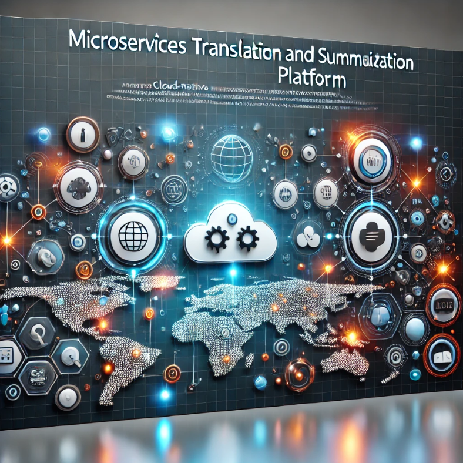

# **Microservices Translation and Summarization Platform**

  
  
  


---

## 📋 **Project Description**
This platform is a cloud-native microservices-based solution for real-time translation and text summarization. It uses advanced NLP models, a scalable architecture, and supports secure user management with asynchronous communication.

---

## 🖼️ **Banner**


---

## 🌟 **Features**
- Real-time English-to-Arabic and Arabic-to-English translation.
- Customizable summarization styles (formal, informal, technical).
- Secure and scalable microservices architecture.
- Asynchronous processing using Apache Kafka.
- Dockerized services for easy deployment.

---

## 🛠️ **Requirements**
- Python 3.9+
- Docker (for containerization)
- Postman (for API testing)

---

## 📦 **Installation**
### **EN2AR-Service (English to Arabic Translation)**

1. Clone the repository:
   ```bash
   git clone <repository-url>
   cd microservices-translation-summarization-platform/en2ar_service
2. Install dependencies:
   ```bash
   pip install -r en2ar_service/requirements.txt
4. Run the service:
   ```bash
   uvicorn en2ar_service.main:app --host 0.0.0.0 --port 8000
6. Alternatively, build and run the Docker container:
   ```bash
   docker build -t en2ar-service .
   docker run -p 8000:8000 en2ar-service

---
  
### **AR2EN-Service (Arabic to English Translation)**

1. Clone the repository:
   ```bash
   cd microservices-translation-summarization-platform/ar2en_service

2. Install dependencies:
   ```bash
   pip install -r ar2en_service/requirements.txt

4. Run the service:
   ```bash
   uvicorn ar2en_service.main:app --host 0.0.0.0 --port 8000

6. Alternatively, build and run the Docker container:
   ```bash
   docker build -t ar2en-service .
   docker run -p 8000:8000 ar2en-service

---

## 📑 **Documentation**
For detailed API documentation, access FastAPI's Swagger UI:
- EN2AR-Service: http://localhost:8000/docs
- AR2EN-Service: http://localhost:8000/docs

---

## 📦 Installation
1. Clone the repository:
   ```bash
   https://github.com/salahezzt120/microservices-translation-summarization-platform.git
